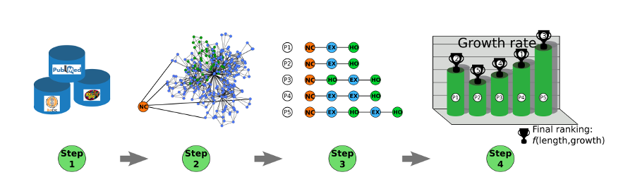

# FindPath

FindPath is an unified system predicting and ranking the possible pathways according to their metabolic efficiency in cellular context. This tool rely on chemical reactions database to generate all possible metabolic pathways and exploits constraint-based models (CBMs) to identify the synthetic pathway that is the most effective for achieving a desired metabolic function in a given host microorganism. FindPath is compliant with common tools for CBM manipulation and uses the standard SBML format for both input and output files.

## FindPath workflow

*Step 1*: Creation of a substrate-associated reaction database from literature and metabolic databases.

*Step 2*: Conversion of the database into a CBM and computation of all possible pathways.

*Step 3*: Selection of the pathways according to the pathways length and metabolite constraints.

*Step 4*: Ranking of pathways according to their efficiency to achieve a user-defined objective function (e.g. growth rate). Orange: new compounds, blue: exogenous metabolites, green: host metabolites. 

